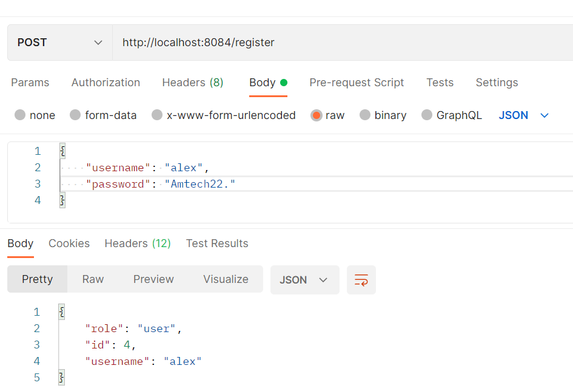
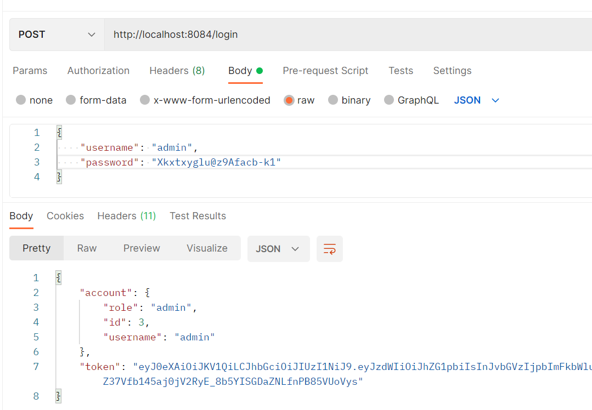

<div align="center">
  <h2>JWTAuthentication</h2>
  <p>
    JWTAuthentication is a JWT based authentication micro service developped with Spring. It is part of a school practical project that aims to extend our skills on web app development and team work.<br>
    <a href="https://github.com/Alessandro-AP/JWTAuthentication/wiki"><strong>Explore the wiki »</strong></a><br><br>
    Main project can be found here :
    <a href="https://github.com/Ga-3tan/AMT_Project">https://github.com/Ga-3tan/AMT_Project</a>
  </p>
</div>


<!-- TABLE OF CONTENTS -->

<details>
  <summary>Table of Contents</summary>
  <ol>
    <li>
      <a href="#about-the-project">About The Project</a>
      <ul>
        <li><a href="#built-with">Built With</a></li>
      </ul>
    </li>
    <li>
      <a href="#getting-started">Getting Started</a>
      <ul>
        <li><a href="#prerequisites">Prerequisites</a></li>
        <li><a href="#installation">Installation</a></li>
      </ul>
    </li>
    <li><a href="#usage">Usage</a></li>
    <li><a href="#contact">Contact</a></li>
    <li><a href="#license">License</a></li>
  </ol>
</details>


<!-- ABOUT THE PROJECT -->

## About The Project

This project is an API Rest that provides an authentication service using JWT tokens.


### Built With

* [Spring](https://spring.io/)
* [MySQL](https://www.mysql.com/)

<!-- GETTING STARTED -->

## Getting Started
### Prerequisites

You need the following components to use the projet, please make sure you have installed them :

* [Java 11](https://jdk.java.net/11/)
* [Maven 3.6.0](https://maven.apache.org/install.html)
* [Docker](https://docs.docker.com/get-docker/)

### Installation
1. Clone the repo.

```sh
git clone https://github.com/Alessandro-AP/JWTAuthentication.git
```

2. Open a terminal in the same location as the `pom.xml` and enter the command:
```sh
mvn clean install
```
This command will clean up the `target/` folder and perform the `install` cycle (validate, compile, test, package, verify) in order to create a .jar artefact in the `target/` folder.

3. In the same directory as before, enter the command: 
```sh
docker-compose up -d
```
The `docker-compose.yml` lets you bring up a complete docker development environment, it will install two main services:

**springboot-auth** : Spring Boot REST API which runs on port 8084.<br>
**mysql-auth** : MySQL DB which runs on port 3306

(**Warning**: make sure these ports are free, otherwise change them in the docker-compose.yml) <br>
(**Warning**: Make sure that "mysql container" and "spring boot container" are both running because if the spring boot container starts before the mysql container is properly started the spring boot container will not start.
In that case you will need to restart manually the spring boot container.)
## Usage
Documentation swagger https://app.swaggerhub.com/apis-docs/gaetan.zwick/Authentication-MIcroservice/v1 

Once the application has been launched, two actions are possible:

1. **Register**: A user can register at the endpoint `/register` by sending an HTTP POST request containing a JSON body with a username and a password (see the example below)



2. **Login** : A user can login to the `/login` endpoint by sending an HTTP POST request containing a JSON body with a username and a password (see the example below)



---

<!-- CONTACT -->
## Contact
[Alessandro Parrino](https://github.com/Alessandro-AP) <br>
[Daniel Sciarra](https://github.com/DS-Daniel) <br>
[Marco Maziero](https://github.com/MazieroMarco) <br>
[Gaétan Zwick](https://github.com/Ga-3tan) <br>
[Anh Mai Hoang](https://github.com/MaIT-HgA) <br>

Project Link: [https://github.com/Alessandro-AP/JWTAuthentication](https://github.com/Alessandro-AP/JWTAuthentication)

<!-- LICENSE -->
## License

Distributed under the MIT License. See `LICENSE.txt` for more information.

<p align="right">(<a href="#top">back to top</a>)</p>
